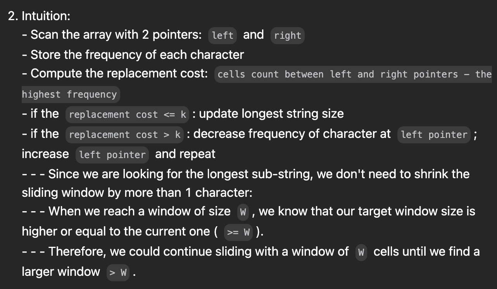

# LC 424. Longest Repeating Character Replacement

## Problem

It's a sliding window problem.


source: [posted solution with Python code](https://leetcode.com/problems/longest-repeating-character-replacement/solutions/765776/python-two-pointers-process-for-coding-interviews)

## Solution

```python
def index(c):
    return ord(c) - ord("A")

class Solution:
    def characterReplacement(self, s: str, k: int) -> int:
        l, r = 0, 0
        
        longestSubString = 0
        maxCharCount = 0
        count = [0] * 26
        while r < len(s):
            count[index(s[r])] += 1
            maxCharCount = max(maxCharCount, count[index(s[r])])

            if r-l+1-maxCharCount > k:
                count[index(s[l])] -= 1
                l += 1
            
            longestSubString = max(longestSubString, r-l+1)
            r += 1 

        return longestSubString 

            
```
[my submission link](https://leetcode.com/problems/longest-repeating-character-replacement/submissions/1508993994)

> [!NOTE]  
> My code is similar to [this posted solution with Java code](https://leetcode.com/problems/longest-repeating-character-replacement/solutions/91271/java-12-lines-o-n-sliding-window-solution-with-explanation) but the explanation is better on [this posted solution with C++ code](https://leetcode.com/problems/longest-repeating-character-replacement/solutions/91285/sliding-window-similar-to-finding-longest-substring-with-k-distinct-characters) and with much more details on [this posted solution with Python code](https://leetcode.com/problems/longest-repeating-character-replacement/solutions/765776/python-two-pointers-process-for-coding-interviews).
